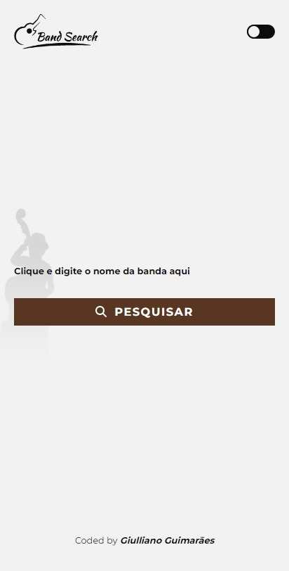
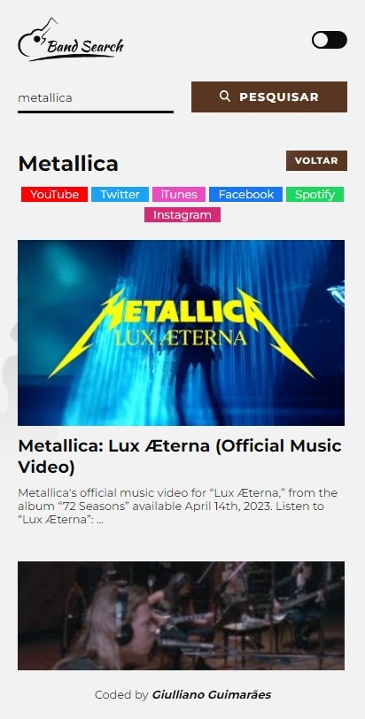
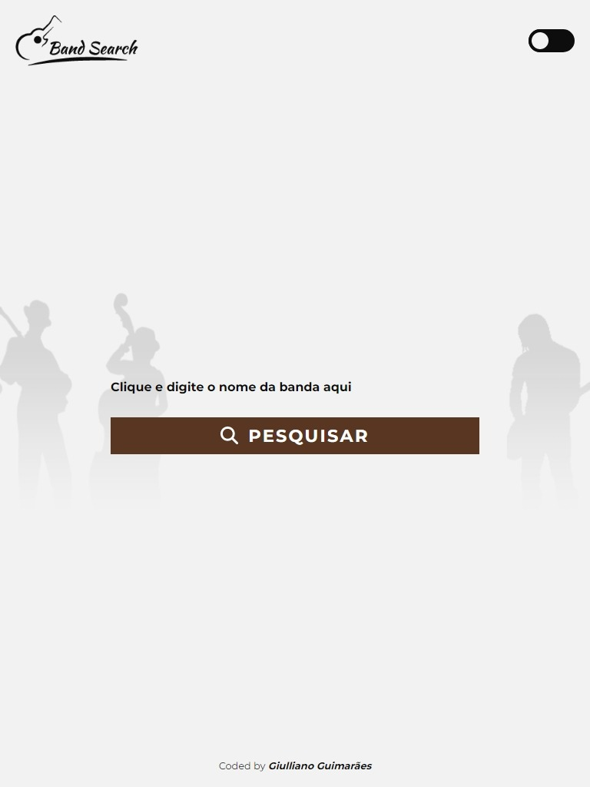
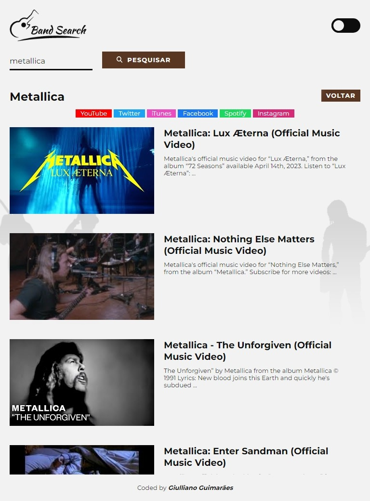
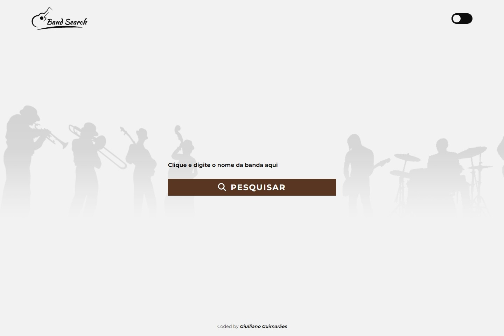
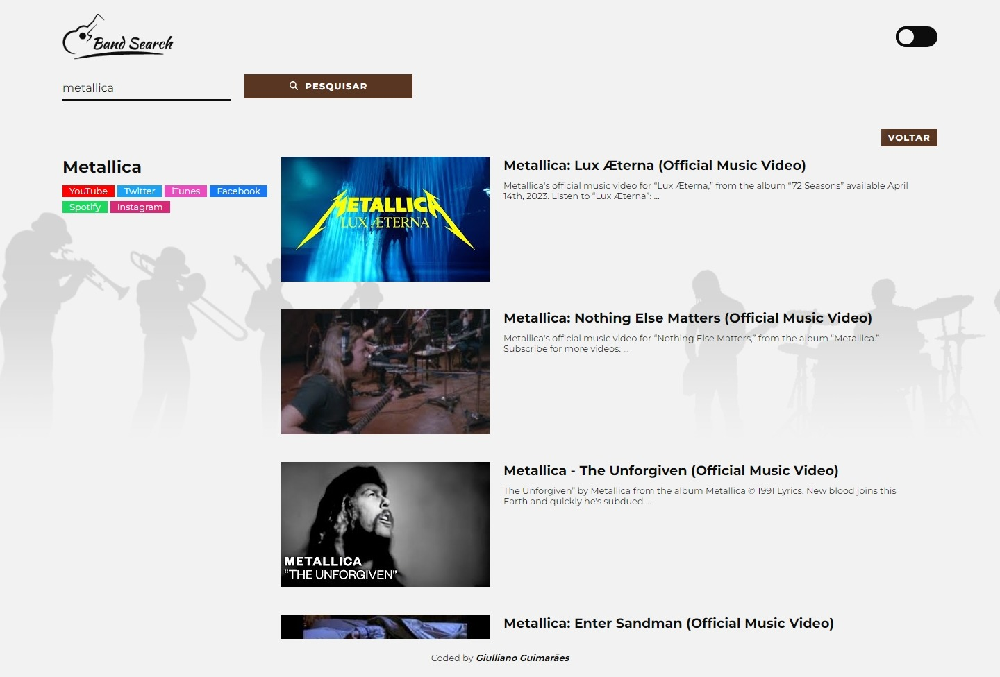

# Band Search - Buscador de Bandas / Artistas

Este é um projeto de busca de bandas e artistas internacionais, onde por meio de pesquisa, é retornado informações de redes sociais e uma lista de vídeos do YouTube. Esses dados são obtido através das APIs do [YouTube](https://developers.google.com/youtube/v3) e [Ticketmaster](https://developer.ticketmaster.com/products-and-docs/apis/discovery-api/v2/).

O projeto foi construído com a biblioteca [React JS](https://reactjs.org/).

## Capturas de tela

### Capturas em 412px:

### Capturas em 768px:

### Capturas em 1440px:

---

- [X] Título
- [X] Vídeos / imagens / demos
- [X] Introdução
- [ ] Como instalar / utilizar
- [ ] Considerações - notas importantes (opcional)